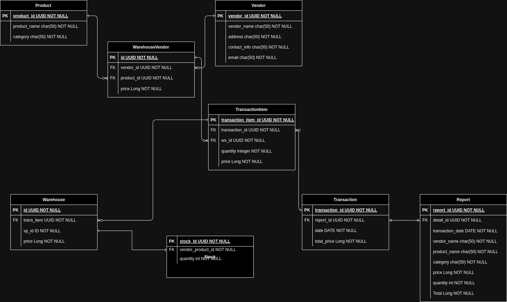

# LIVE CODE 5 COLLABORATION (WAREHOUSE-VENDOR)


*This ERD is not reflect final, only for the workflow, because we add several things in table. But the changes is minimal, so this ERD is still relevant and become based of our project*
*The difference with our final is we didnt need stock table like in ERD because we can update stock in warehouse*
## Tema/Theme
Transaction (Warehouse-Vendor Transaction)


### Workflow
In this project, we create E-Procurement, We have 2 main things in here.
WAREHOUSE (OUR WAREHOUSE)
VENDORPRODUCT (VENDOR WAREHOUSE)

When we want to buy product, we buy from VENDOR WAREHOUSE. In this Vendor Warehouse, there are many vendors with different many products.
We can called it like catalog book.

Then, we buying it through transaction, this transaction will get the product and it will have quantity and price.

When finish buying, we store that product in Our Warehouse.
And at the same time, we also have a report of buying, which can be filter by day or month.


## Member & Task
- Zarek Gema Galgani (Ketua/Tech Lead)
    - Responsible for Report Feature, Handling Error, Validation, Common Response
    - Handle for all modular feature and combine it in my feature
    - Handle for unrecogsinable error, bug.
    - Creating ERD for this project.
    - Create method for filtering by day and month in Report.
    - Create export to csv feature
- Alfin Adzuhri Delangga Putra
    - Responsible for transaction product from vendor (create table transaction, transaction detail)
    - Handle the logic from VENDOR WAREHOUSE to Transaction and then to OUR WAREHOUSE
    - Handle error controller for transaction 
    - Added specific response and only work for transaction.
    - Handle logic for addition of stock when buying same product.
    - Handle logic of past record in Warehouse.
    - Handle logic of : At transaction when product is exist in warehouse and if price is updated in VendorProduct(Warehouse Vendor), new product will be added to our warehouse.
      And its not increase stock of old product because it has different price, so the same product from same vendor with past price will have different ID with new price same product from same vendor.
- Alsatika Wulansari
    - Responsible for goods management include create table warehouse or entity Warehouse, clean code, and DTO
    - Handle pagination, response entity for Warehouse.
- Luky Ana Adi Pratama
    - Responsible for Vendor Management (Create Product, Vendor, and VendorProduct(WAREHOUSE VENDOR) Table/Entity and dto)
    - Handle pagination, response entity for Product, Vendor and vendorProduct(WAREHOUSE VENDOR)
    - Make Constant package which is include APIUrl class, ConstantTable class, and ResponseMessage to organize custome message, path and table name
    - Git officer, responsible for collaboration project repository in gitlab like merge, push, pull and etc.

## FEATURE
1. Warehouse(Our) management, this feature aims to
   a. View data on goods in the warehouse
   b. Register new items
   In this feature, the warehouse table has:
- A many-to-one relation with the stock table, referencing the column name id
- A many-to-one relation with the transaction_detail table, referencing the column name id
  With this relationship, we can retrieve data on the goods in the warehouse. To register new items into the warehouse,
  we use the create method in the service(with DTO) This method calls the repository, which has been extended to JPA Repository,
  and call it in the controller section.
  <hr>
  The created methods include:
- create: to save data from transaction after we buying from vendor.
- getAll: for retrieving all data from each table, for this method we already create page, so when we input
  minus page, like page=-1, it will retrieve all data. This is in fact our intention to show all data, because it is make more sense.
- getById: to retrieve data based on a specific ID,
- update: if there's a need to update prices in the warehouse table,
- delete: to remove table data based on its ID.

Here, our result in getAll method in this feature:
```json
{
  "statusCode": 200,
  "message": "Successfully Fetch Data",
  "data": [
    {
      "id": "f6382f54-74db-4f80-b6a3-b4cd4b80d399",
      "transaction": {
        "id": "a19e6b11-f027-4116-8d49-f72ba84c2c66",
        "vendor": {
          "id": "f35fc52a-7326-496a-b2b5-4b32d90d9684",
          "name": "Vendor A",
          "mobilePhoneNo": "08122062867",
          "address": "123 Main St, City A",
          "email": "vendorA@example.com"
        },
        "transactionDate": "2024-05-15T15:48:11.541+07:00",
        "transactionDetails": [
          {
            "id": "f5deb8f5-168c-4078-89e9-70afd72f04ea",
            "vendorProduct": {
              "id": "1",
              "product": {
                "id": "e6b9cb59-824d-4791-9eea-6120d38f97d9",
                "name": "Bola Basket",
                "category": "Sports"
              },
              "vendor": {
                "id": "f35fc52a-7326-496a-b2b5-4b32d90d9684",
                "name": "Vendor A",
                "mobilePhoneNo": "08122062867",
                "address": "123 Main St, City A",
                "email": "vendorA@example.com"
              },
              "price": 20000
            },
            "quantity": 4,
            "price": 20000
          }
        ]
      },
      "vpId": "1",
      "price": 20000,
      "stock": 26
    },
    {
      "id": "15208afa-079e-4fb8-bd4a-f91b26219ea9",
      "transaction": {
        "id": "7b8ab51a-3ebc-4126-8ff5-606274ad1ab9",
        "vendor": {
          "id": "f35fc52a-7326-496a-b2b5-4b32d90d9684",
          "name": "Vendor A",
          "mobilePhoneNo": "08122062867",
          "address": "123 Main St, City A",
          "email": "vendorA@example.com"
        },
        "transactionDate": "2024-05-15T16:28:38.682+07:00",
        "transactionDetails": [
          {
            "id": "063be780-440b-4bda-b6ad-e51d855daeac",
            "vendorProduct": {
              "id": "3",
              "product": {
                "id": "e6b9cb59-824d-4791-9eea-6120d38f97d9",
                "name": "Bola Basket",
                "category": "Sports"
              },
              "vendor": {
                "id": "3f2614b0-a350-4ec5-bb39-3499454ca0dd",
                "name": "Vendor C",
                "mobilePhoneNo": "082245182821",
                "address": "789 Oak St, City C",
                "email": "vendorC@example.com"
              },
              "price": 3000
            },
            "quantity": 2,
            "price": 3000
          },
          {
            "id": "47e4fee7-b00c-4698-bc00-81976c7ef3a9",
            "vendorProduct": {
              "id": "1",
              "product": {
                "id": "e6b9cb59-824d-4791-9eea-6120d38f97d9",
                "name": "Bola Basket",
                "category": "Sports"
              },
              "vendor": {
                "id": "f35fc52a-7326-496a-b2b5-4b32d90d9684",
                "name": "Vendor A",
                "mobilePhoneNo": "08122062867",
                "address": "123 Main St, City A",
                "email": "vendorA@example.com"
              },
              "price": 20000
            },
            "quantity": 4,
            "price": 20000
          },
          {
            "id": "ea336fcb-3960-488a-8244-73bb7f99b004",
            "vendorProduct": {
              "id": "2",
              "product": {
                "id": "e6b9cb59-824d-4791-9eea-6120d38f97d9",
                "name": "Bola Basket",
                "category": "Sports"
              },
              "vendor": {
                "id": "33d0a242-642e-415d-b0f4-e2c6f760e19d",
                "name": "Vendor B",
                "mobilePhoneNo": "08224518267",
                "address": "456 Elm St, City B",
                "email": "vendorB@example.com"
              },
              "price": 25000
            },
            "quantity": 4,
            "price": 25000
          }
        ]
      },
      "vpId": "2",
      "price": 25000,
      "stock": 16
    },
    {
      "id": "78b20238-4512-4da0-af79-807096535f41",
      "transaction": {
        "id": "7b8ab51a-3ebc-4126-8ff5-606274ad1ab9",
        "vendor": {
          "id": "f35fc52a-7326-496a-b2b5-4b32d90d9684",
          "name": "Vendor A",
          "mobilePhoneNo": "08122062867",
          "address": "123 Main St, City A",
          "email": "vendorA@example.com"
        },
        "transactionDate": "2024-05-15T16:28:38.682+07:00",
        "transactionDetails": [
          {
            "id": "063be780-440b-4bda-b6ad-e51d855daeac",
            "vendorProduct": {
              "id": "3",
              "product": {
                "id": "e6b9cb59-824d-4791-9eea-6120d38f97d9",
                "name": "Bola Basket",
                "category": "Sports"
              },
              "vendor": {
                "id": "3f2614b0-a350-4ec5-bb39-3499454ca0dd",
                "name": "Vendor C",
                "mobilePhoneNo": "082245182821",
                "address": "789 Oak St, City C",
                "email": "vendorC@example.com"
              },
              "price": 3000
            },
            "quantity": 2,
            "price": 3000
          },
          {
            "id": "47e4fee7-b00c-4698-bc00-81976c7ef3a9",
            "vendorProduct": {
              "id": "1",
              "product": {
                "id": "e6b9cb59-824d-4791-9eea-6120d38f97d9",
                "name": "Bola Basket",
                "category": "Sports"
              },
              "vendor": {
                "id": "f35fc52a-7326-496a-b2b5-4b32d90d9684",
                "name": "Vendor A",
                "mobilePhoneNo": "08122062867",
                "address": "123 Main St, City A",
                "email": "vendorA@example.com"
              },
              "price": 20000
            },
            "quantity": 4,
            "price": 20000
          },
          {
            "id": "ea336fcb-3960-488a-8244-73bb7f99b004",
            "vendorProduct": {
              "id": "2",
              "product": {
                "id": "e6b9cb59-824d-4791-9eea-6120d38f97d9",
                "name": "Bola Basket",
                "category": "Sports"
              },
              "vendor": {
                "id": "33d0a242-642e-415d-b0f4-e2c6f760e19d",
                "name": "Vendor B",
                "mobilePhoneNo": "08224518267",
                "address": "456 Elm St, City B",
                "email": "vendorB@example.com"
              },
              "price": 25000
            },
            "quantity": 4,
            "price": 25000
          }
        ]
      },
      "vpId": "3",
      "price": 3000,
      "stock": 10
    }
  ],
  "paging": {
    "totalPages": 1,
    "totalElements": 3,
    "page": 0,
    "size": 10,
    "hasNext": false,
    "hasPrevious": false
  }
}

```

2. Vendor Management, this feature aims to
   a. view vendor list
   b. regist new vendor with the products supplied and the price
   c. updating price when the price is changes
   In this feature, there are several tables that are related to each other, namely:
- The vendorProduct table has a many-to-one relationship with the product table, referencing the column name id
- The vendorProduct table has a many-to-one relationship with the vendor table, referencing the column name id
  With this relationship, we can view the list of existing vendors. To register a new vendor along with the supplied
  items, including their prices, we use the create method in the service(with DTO) this method calls the repository, which has
  been extended to JPA Repository, and is invoked in the controller section. Additionally, to update prices in case
  of any changes, we utilize the update method in the service, which again calls the repository extended to
  JPA Repository and is invoked in the controller section.
  <hr>
  The methods that have been created are as follows:
- create: for creating new data
- getAll: for retrieving all data from each table, for this method we already create page, so when we input
  minus page, like page=-1, it will retrieve all data. This is in fact our intention to show all data, because it is make more sense.
- getById: for retrieving data based on a specific ID
- update: for updating data in the table
- delete: for deleting table data based on its ID.

Here, result using getAll :
```json
{
  "statusCode": 200,
  "message": "Successfully Fetch Data",
  "data": [
    {
      "id": "f35fc52a-7326-496a-b2b5-4b32d90d9684",
      "name": "Vendor A",
      "mobilePhoneNo": "08122062867",
      "address": "123 Main St, City A",
      "email": "vendorA@example.com"
    },
    {
      "id": "33d0a242-642e-415d-b0f4-e2c6f760e19d",
      "name": "Vendor B",
      "mobilePhoneNo": "08224518267",
      "address": "456 Elm St, City B",
      "email": "vendorB@example.com"
    },
    {
      "id": "3f2614b0-a350-4ec5-bb39-3499454ca0dd",
      "name": "Vendor C",
      "mobilePhoneNo": "082245182821",
      "address": "789 Oak St, City C",
      "email": "vendorC@example.com"
    }
  ],
  "paging": {
    "totalPages": 1,
    "totalElements": 3,
    "page": 0,
    "size": 10,
    "hasNext": false,
    "hasPrevious": false
  }
}
```

3. Purchase Transaction Feature, This feature aims to store all purchase data for goods in
   our store.
    <hr>
   With a many-to-one relationship from the transaction table to the vendor table, and then a one-to-many
   relationship from the transaction table to the transaction detail table, we can store and create purchase data for goods.
   In this feature, we are adding a new table called "report" to store all reports so that we can view daily and monthly reports.
   <hr>
   The methods that have been created are as follows:
- create: for creating new transaction
- getAll for retrieving all data from each table
- createBulk : is used to create transaction details that exist within a transaction.

```json
{
    "statusCode": 200,
    "message": "success get all product",
    "data": [
        {
            "id": "a19e6b11-f027-4116-8d49-f72ba84c2c66",
            "vendorName": "Vendor A",
            "transactionDate": "2024-05-15T15:48:11.541+07:00",
            "transactionDetailResponses": [
                {
                    "productName": "Bola Basket",
                    "price": 20000,
                    "quantity": 4
                }
            ]
        },
        {
            "id": "dd4e7157-a8a3-458d-abad-482f4df22bc4",
            "vendorName": "Vendor A",
            "transactionDate": "2024-05-15T15:55:54.230+07:00",
            "transactionDetailResponses": [
                {
                    "productName": "Bola Basket",
                    "price": 20000,
                    "quantity": 4
                }
            ]
        },
        {
            "id": "7abe2ef2-ec81-44b1-8918-f4d04909044f",
            "vendorName": "Vendor A",
            "transactionDate": "2024-05-15T16:24:09.163+07:00",
            "transactionDetailResponses": [
                {
                    "productName": "Bola Basket",
                    "price": 20000,
                    "quantity": 4
                }
            ]
        },
        {
            "id": "7b8ab51a-3ebc-4126-8ff5-606274ad1ab9",
            "vendorName": "Vendor A",
            "transactionDate": "2024-05-15T16:28:38.682+07:00",
            "transactionDetailResponses": [
                {
                    "productName": "Bola Basket",
                    "price": 3000,
                    "quantity": 2
                },
                {
                    "productName": "Bola Basket",
                    "price": 20000,
                    "quantity": 4
                },
                {
                    "productName": "Bola Basket",
                    "price": 25000,
                    "quantity": 4
                }
            ]
        },
        {
            "id": "54c152ae-6124-446e-b3ae-199c74304b01",
            "vendorName": "Vendor A",
            "transactionDate": "2024-05-15T17:08:30.313+07:00",
            "transactionDetailResponses": [
                {
                    "productName": "Bola Basket",
                    "price": 3000,
                    "quantity": 2
                },
                {
                    "productName": "Bola Basket",
                    "price": 20000,
                    "quantity": 4
                },
                {
                    "productName": "Bola Basket",
                    "price": 25000,
                    "quantity": 4
                }
            ]
        }
    ],
    "paging": {
        "totalPages": 2,
        "totalElements": 9,
        "page": 1,
        "size": 5,
        "hasNext": true,
        "hasPrevious": false
    }
}

```

4. Reports Feature, This feature aims to view the details of today's purchase transactions also monthly purchase transactions in the store based on:
    - Today's purchases
    - Monthly purchases
      This table related to Transaction tables, which from there we can access it to any table (except VendorProduct (Warehouse Vendor)) using Id.
      In this feature, the methods that have been created are as follows:
    - createReport : This method is to get the date from transaction at buying.
    - getAllReport : To retrieve all data (Mainly also be used for view daily report).
      Or retrieving all data from each table, for this method we already create page, so when we input
      minus page, like page=-1, it will retrieve all data. This is in fact our intention to show all data, because it is make more sense.
    - getReportsBetweenDate : In this method, our aim is to deliver data based on the month we buy the product.
    - Also in this Reports Feature, we have method **exportToCsv**, which like the name, it export the data from table Reports to CSV format.
      The data in CSV FORMAT is same with table.

   Here result for daily getAll:
```json
{
  "statusCode": 200,
  "message": "Successfully Fetch Data",
  "data": [
    {
      "id": "fe1a6988-2b27-4333-a553-09a5f96877ee",
      "transDate": "2024-05-15",
      "vendorName": null,
      "productName": "Bola Basket",
      "category": null,
      "price": 20000,
      "quantity": 4,
      "total": 80000
    },
    {
      "id": "98cf249b-954b-4e66-a990-ad203b207c98",
      "transDate": "2024-05-15",
      "vendorName": "Vendor A",
      "productName": "Bola Basket",
      "category": "Sports",
      "price": 20000,
      "quantity": 4,
      "total": 80000
    },
    {
      "id": "d22152c9-0214-4d36-afcc-85cc518d03ab",
      "transDate": "2024-05-15",
      "vendorName": "Vendor C",
      "productName": "Bola Basket",
      "category": "Sports",
      "price": 3000,
      "quantity": 2,
      "total": 6000
    },
    {
      "id": "492f33e3-eed4-4a33-8dd9-364fc8deb2a7",
      "transDate": "2024-05-15",
      "vendorName": "Vendor A",
      "productName": "Bola Basket",
      "category": "Sports",
      "price": 20000,
      "quantity": 4,
      "total": 80000
    },
    {
      "id": "7ccf6a71-2b17-4445-a4cf-e7654148a0bf",
      "transDate": "2024-05-15",
      "vendorName": "Vendor B",
      "productName": "Bola Basket",
      "category": "Sports",
      "price": 25000,
      "quantity": 4,
      "total": 100000
    },
    {
      "id": "535b98b2-ae1e-48c7-84f4-c9b44d4513a5",
      "transDate": "2024-05-15",
      "vendorName": "Vendor C",
      "productName": "Bola Basket",
      "category": "Sports",
      "price": 3000,
      "quantity": 2,
      "total": 6000
    },
    {
      "id": "78628002-1fd5-4a97-a84b-0f8f60c4aba8",
      "transDate": "2024-05-15",
      "vendorName": "Vendor A",
      "productName": "Bola Basket",
      "category": "Sports",
      "price": 20000,
      "quantity": 4,
      "total": 80000
    },
    {
      "id": "99577502-5dee-455d-8864-0fef7ea89080",
      "transDate": "2024-05-15",
      "vendorName": "Vendor B",
      "productName": "Bola Basket",
      "category": "Sports",
      "price": 25000,
      "quantity": 4,
      "total": 100000
    },
    {
      "id": "148d3769-48f5-4263-86e0-f17fbde95aa3",
      "transDate": "2024-05-15",
      "vendorName": "Vendor C",
      "productName": "Bola Basket",
      "category": "Sports",
      "price": 3000,
      "quantity": 2,
      "total": 6000
    },
    {
      "id": "707d55dc-90df-4427-aa58-c1c385d62a2a",
      "transDate": "2024-05-15",
      "vendorName": "Vendor A",
      "productName": "Bola Basket",
      "category": "Sports",
      "price": 20000,
      "quantity": 4,
      "total": 80000
    }
  ],
  "paging": {
    "totalPages": 2,
    "totalElements": 14,
    "page": 0,
    "size": 10,
    "hasNext": true,
    "hasPrevious": false
  }
}

```